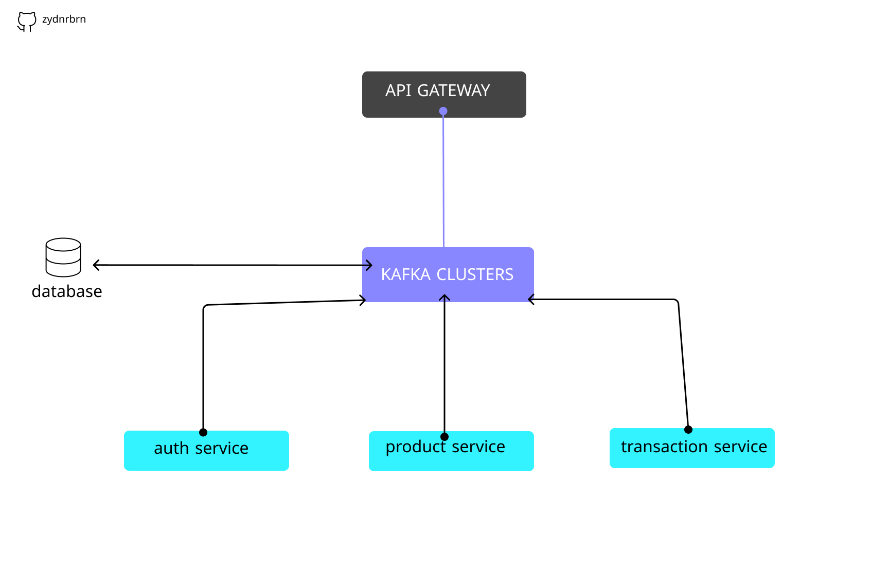

# Simple Orders Apps with Microsevices Implementation
This is the architecture that i used, it just simple architecture.
</img>

# Tools Required
* Docker
* JDK 17 (For Spring Boot)
* IDE's (Im use Visual Studio Code)

note: Im very recommend for use Native Zookeeper from official website <a href='https://zookeeper.apache.org/'>Zookeper</a> in production.

# Spring Boot

### Reference Documentation
For further reference, please consider the following sections:

* [Official Apache Maven documentation](https://maven.apache.org/guides/index.html)
* [Spring Boot Maven Plugin Reference Guide](https://docs.spring.io/spring-boot/docs/3.0.6/maven-plugin/reference/html/)
* [Create an OCI image](https://docs.spring.io/spring-boot/docs/3.0.6/maven-plugin/reference/html/#build-image)
* [Spring Web](https://docs.spring.io/spring-boot/docs/3.0.6/reference/htmlsingle/#web)

### Guides
The following guides illustrate how to use some features concretely:

* [Building a RESTful Web Service](https://spring.io/guides/gs/rest-service/)
* [Serving Web Content with Spring MVC](https://spring.io/guides/gs/serving-web-content/)
* [Building REST services with Spring](https://spring.io/guides/tutorials/rest/)

